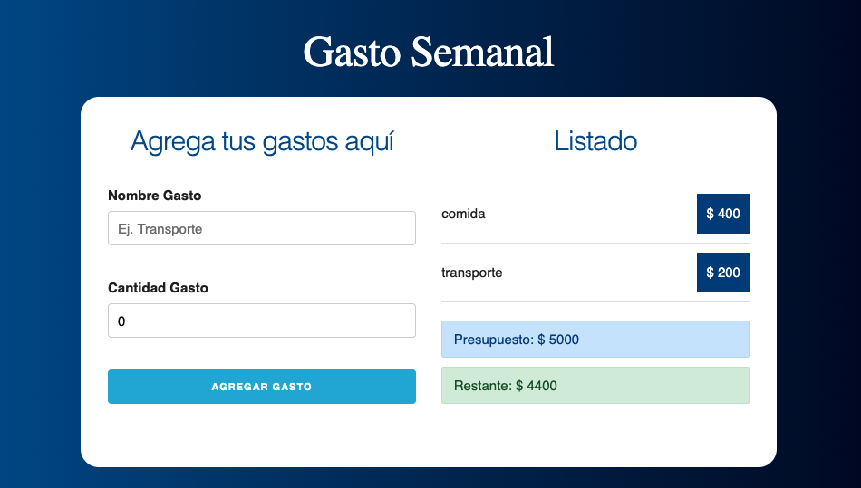

Budget control project.

First you enter a total budget. Then the name of the expense and the amount spent are added. On the right side, the expenses will be listed with their details. The remaining total will also be shown, which will change color depending on how much capital is available.

Made with React.js
🧡

https://jovial-bhabha-8166e3.netlify.app
